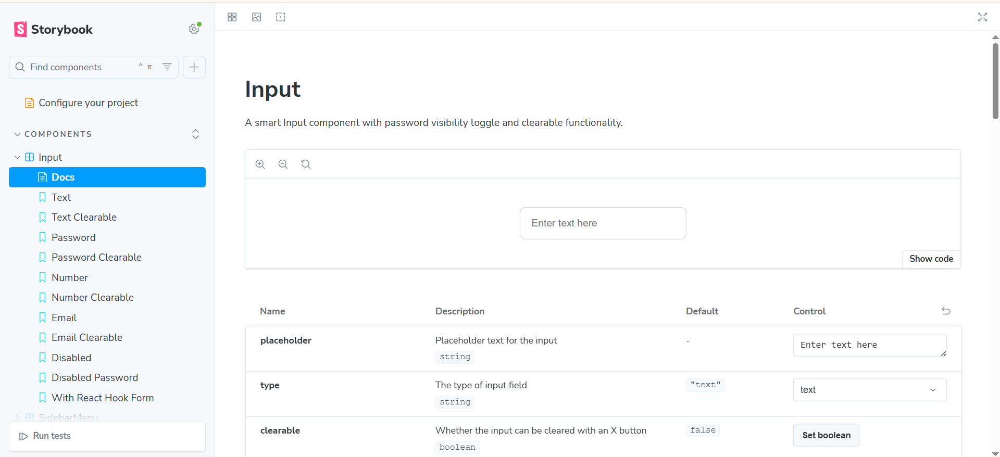

# React Component Library

A modern React component library built with Next.js, TypeScript, and Storybook.

## 🚀 Quick Start

```bash
# Install dependencies
npm install

# Start development server
npm run dev

# Open Storybook
npm run storybook
```

## 📦 Components

### Input Component

Versatile input with password toggle, clearable option, and validation states.

```tsx
import { Input } from "@/components/Input";

<Input
  type="text"
  placeholder="Enter your name"
  clearable
  onChange={(value) => console.log(value)}
/>;
```

### Toast Component

Notification system with auto-dismiss and smooth animations.

```tsx
import { Toast } from "@/components/Toast";

<Toast
  type="success"
  title="Success!"
  message="Operation completed successfully."
  isVisible={showToast}
  onDismiss={() => setShowToast(false)}
/>;
```

### SidebarMenu Component

Nested sidebar menu with accordion-style submenus and sliding animations.

```tsx
import { SidebarMenu } from "@/components/SidebarMenu";

<SidebarMenu
  isOpen={isOpen}
  items={menuItems}
  onClose={() => setIsOpen(false)}
  onItemClick={(item) => console.log("Clicked:", item)}
/>;
```

## 📸 Screenshots

### Component States

#### Input Component Examples

**Password Input - Hidden State**

_Password field with masked input and eye icon for visibility toggle_

**Password Input - Visible State**  

_Password field with revealed text and eye-slash icon to hide_

#### Toast Component Examples

**Success Toast**

_Green success notification with auto-dismiss timer_

**Error Toast**

_Red error notification with close button_

#### SidebarMenu Component Examples

**Closed State**

_Main application with sidebar hidden_

**Open State with Nested Menu**

_Sidebar sliding in from right with expanded submenu_

### Interface Screenshots

#### Storybook Interface

**Input Component in Storybook**

_Input component with controls panel showing all available props_

**Toast Component in Storybook**

_Toast component with different type variants and duration controls_

**SidebarMenu Component in Storybook**

_SidebarMenu component with nested menu examples and open/closed states_

## 🛠️ Setup

### Prerequisites

- Node.js 18+
- npm, yarn, pnpm, or bun

### Installation

1. Clone the repository
2. Run `npm install`
3. Run `npm run dev` for Next.js app
4. Run `npm run storybook` for component documentation

### Available Scripts

- `npm run dev` - Start Next.js development server
- `npm run storybook` - Start Storybook
- `npm run build` - Build for production
- `npm run lint` - Run ESLint

## 📚 Usage

Import components:

```tsx
import { Input, Toast, SidebarMenu } from "@/components";
```

Each component supports TypeScript with full IntelliSense. See Storybook for interactive examples and all available props.

## 🎨 Styling

Components use CSS Modules for scoped styling. Customize via:

- `className` prop
- CSS custom properties
- CSS Module overrides

## 🧪 Testing

Storybook provides interactive testing environment:

- Component variants
- Responsive behavior
- Accessibility features
- Props controls

## 📄 License

MIT License
